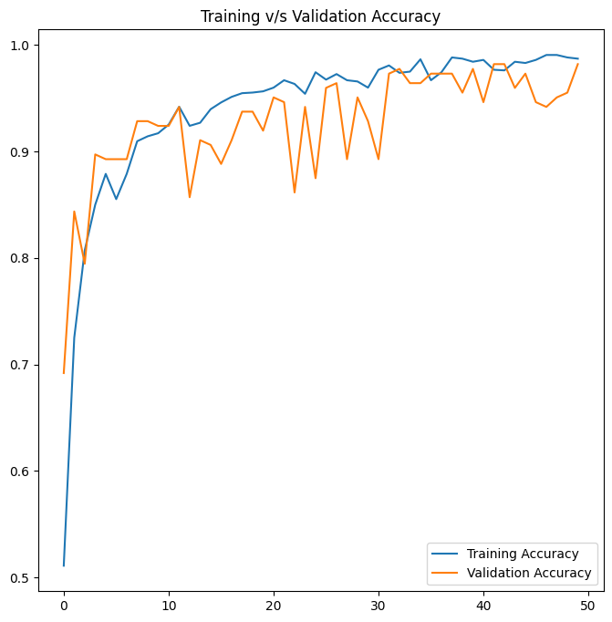
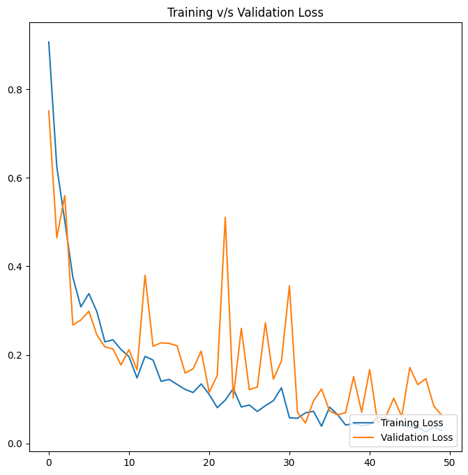
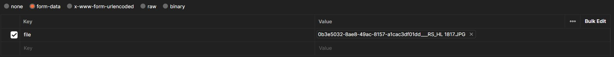
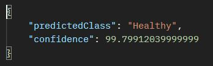
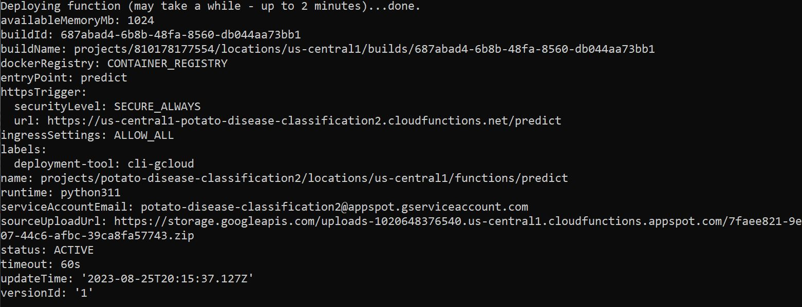

# Problem statement
Farmers who grow potatoes are facing a lot a of economic losses because of various diseases that can happen to a potato plant. There are 2 common diseases:
  - Early blight
  - Late blight
The treatments for Early blight and Late blight are different. So, its important that you should accurately identify what kind of disease is there in that potato plant.

[Dataset Link](https://www.kaggle.com/datasets/arjuntejaswi/plant-village)  

# Tech stack
  - ***Model Building:*** Tensorflow, Keras, CNN (Convolution Neural Network), Data Augmentation, tf dataset, matplotlib, numpy.
  - ***Backend Server:*** tf serving, FastAPI.
  - ***Frontend:*** HTML, CSS, JavaScript.
  - ***Deployment:*** Google Cloud Platform (GCP).

# Day Tracing
## Day 1 (Training the model using CNN)
  - Download Dataset from the given link
  - `image_dataset_from_directory` => loads images from the directory specified. It has a property `class_names` which stores the folder names inside the specifies directory.
  - Dataset split:
    - 80% for training
    - 10% for validation
    - 10% for testing
  - Learnt about `cache()` and `prefetch()` how they are used to improve the performance during the training.
  - Size of each image is 256 x 256
  - Rescaling is done to improve the model acuuracy and performance.
  - Data Pre-processing:
    - Although all of our images are 256 x 256, so resizing does not makes much sense. But in case of real-life use case, any dimension image may be given as input which could create problems and also reduce the accuracy of prediction; so a layers of resizing is added before scaling the image.
    - Data Augmentation:
      - Horizontal and vertical flips
      - Rotation of the images
  - Modeling using CNN: After some trial and error the final architecture of the CNN is 
    ```python
    model = keras.Sequential([
      resizeRescale,
      dataAug,
      keras.layers.Conv2D(32, (3, 3), activation='relu', input_shape=inputShape),
      keras.layers.MaxPooling2D((2, 2)),
      keras.layers.Conv2D(64, (3, 3), activation='relu', input_shape=inputShape),
      keras.layers.MaxPooling2D((2, 2)),
      keras.layers.Conv2D(128, (3, 3), activation='relu', input_shape=inputShape),
      keras.layers.MaxPooling2D((2, 2)),
      keras.layers.Conv2D(64, (3, 3), activation='relu', input_shape=inputShape),
      keras.layers.MaxPooling2D((2, 2)),
      keras.layers.Conv2D(32, (3, 3), activation='relu', input_shape=inputShape),
      keras.layers.MaxPooling2D((2, 2)),
      keras.layers.Conv2D(16, (3, 3), activation='relu', input_shape=inputShape),
      keras.layers.MaxPooling2D((2, 2)),
      keras.layers.Flatten(),
      keras.layers.Dense(64, activation='relu'),
      keras.layers.Dense(32, activation='relu'),
      keras.layers.Dense(nClasses, activation='softmax')
    ])
    ```
    - Optimizer: Adam
    - Loss function: Sparse Categorical Cross Entropy
    - Metrics: Accuracy
    - Achievements:
      - For Testing Dataset:
        - Accuracy: 0.9750000238418579 ≈ 0.975 => 97.50 %
        - Loss: 0.11667297035455704

 

The various versions of the models are saved in ``./Models`` directory.  

## Day 2 (FastAPI)
  - Listed all the requirements for building API using FastAPI in `./APIs/requirements.txt` file and installed all of them using pip.
  - Exposed an API `predict`. (POST)
  - Figured out how to give a file as an input. (`async def predict(file: UploadFile)` => function signature)
  - `await file.read()` => Asynchronously read the contents of a file. The `read()` method reads the entire content of the file and returns it as bytes.
  - `BytesIO(...)` => creates an in-memory binary stream that can be read from or written to.
  - `np.array(Image.open(BytesIO(await file.read())))` => converts the file to corresponding numpy array.
  - `np.expand_dims(image, 0)` => increases the dimension by 1.
  - `Model = tf.keras.models.load_model('../Models/2')` => loads a saved model. (Here, model version 2 is loaded)
  - `prediction = Model.predict(np.array([image]))` => `prediction` stores the confidence values for different class indexes. The index with the maximum value is the predicted class index and the maximum value is the confidence value of the predicted class.

## Day 3 (tf serving)
- **tf-serving** makes version management and model servingg very easy.
- Documantation followed: https://www.tensorflow.org/tfx/serving/docker
- Enterred the project directory and run `docker run -it -v .:/potato-disease-classification -p 5000:5000 --entrypoint /bin/bash tensorflow/serving` command in windows powershell.
- Then taken into the docker container, enterred into the `potato-disease-classification` directory and ran `tensorflow_model_server --rest_api_port=5000 --model_config_file=./models.config` command.
- Made some changes in the FastAPI server code.
  - Endpoint: `http://localhost:5000/v1/models/potato_disease_classifier_app:predict`
  - Made some changes in the code.
- Using postman, made a POST request to `http://localhost:3000/predict`
  - Request body:  
  
  - Response Body:  
  

## Day 4 (Deployment in GCP)
- Create a GCP account. ([link](https://console.cloud.google.com/freetrial/signup/tos?_ga=2.25841725.1677013893.1627213171-706917375.1627193643&_gac=1.124122488.1627227734.Cj0KCQjwl_SHBhCQARIsAFIFRVVUZFV7wUg-DVxSlsnlIwSGWxib-owC-s9k6rjWVaF4y7kp1aUv5eQaAj2kEALw_wcB))
- Create a Project on GCP. (Keep track of the project id)
- Created a GCP bucket. (Like Amazon S3, some area in the cloud where the models are deployed)
  - Choose a name that is globally unique. (will be prompted for a valid name)
  - Select `Region` as Delhi or Mumbai
  - Continue with all the defaults
- Create a folder named as `models` and upload the h5 model file in it. (`potatoModel.h5`)
- Install Google cloud SDK and follow the [documentation](https://cloud.google.com/sdk/docs/install-sdk).
- For the first time you have to login with an account as directed in the shell.
- If you have preinstalled Google cloud SDK then follow:
  - run `gcloud init` and create a new configuration
  - follow the options and choose
  - Select the project
- Install the requirements and write the code for GCP.
- Move to the folder where there is the GCP code.
- While in that folder, run `gcloud functions deploy predict --runtime python311 --trigger-http --memory 1024 --project <projectid>`
- Enabled googleapis (as directed by shell).
- Allowed unauthenticated invocations of new function (As directed by shell).
- After successful deploy:  
  
- URL: https://us-central1-potato-disease-classification2.cloudfunctions.net/predict
- Previous URL (was my first deployment): https://us-central1-careful-ensign-394920.cloudfunctions.net/predict

## Day 5 (Complete Frontend Integration and Deployment)
- Wrote a basic HTMl and CSS Script
- Made changes accordingly in the backend file and included the URL (https://potato-disease-classifier.netlify.app) to avoid CORS error
- Finally deployed in Nelify.

### [Final App URL](https://potato-disease-classifier.netlify.app/)